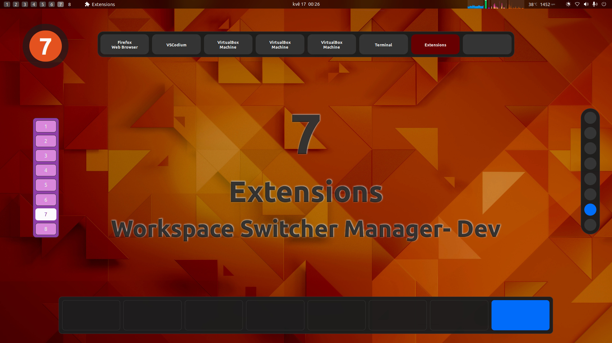
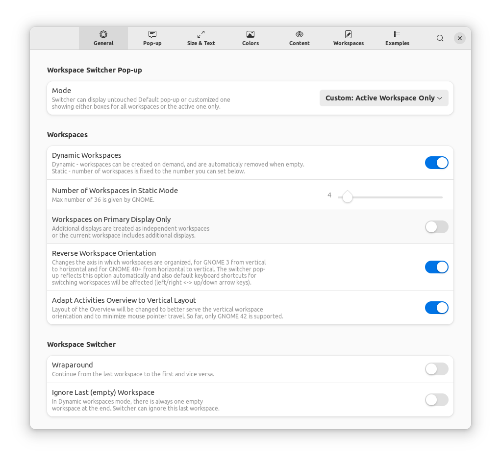
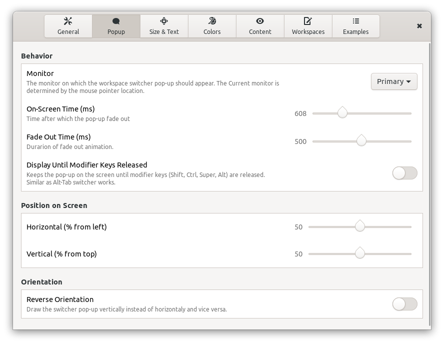
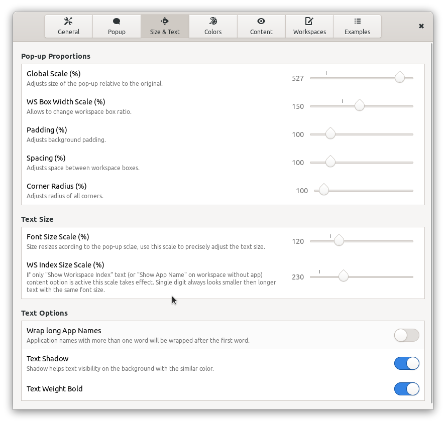
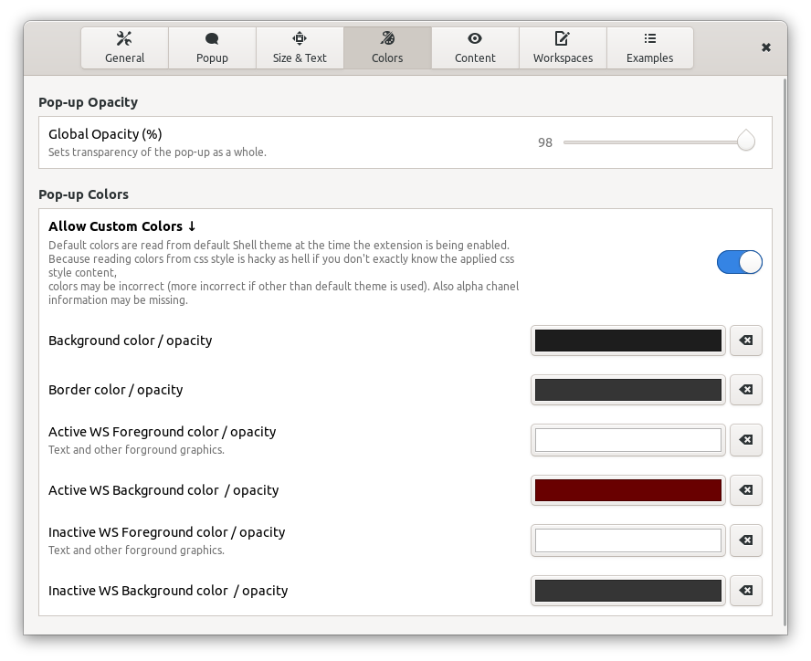
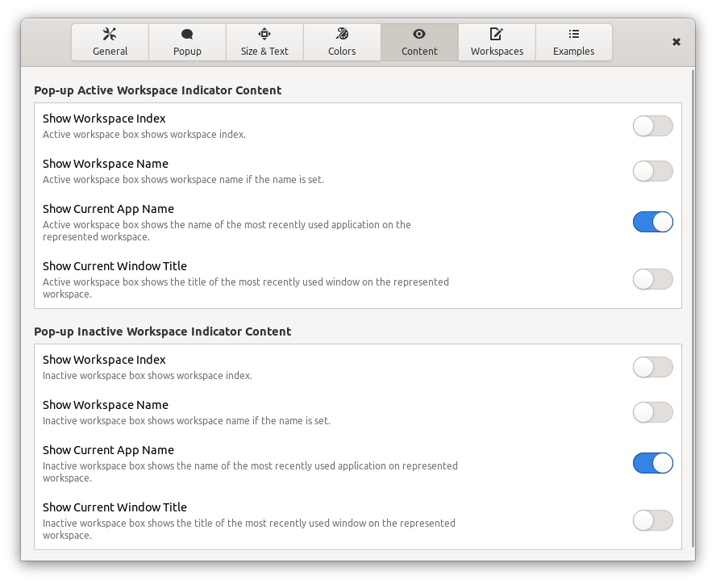
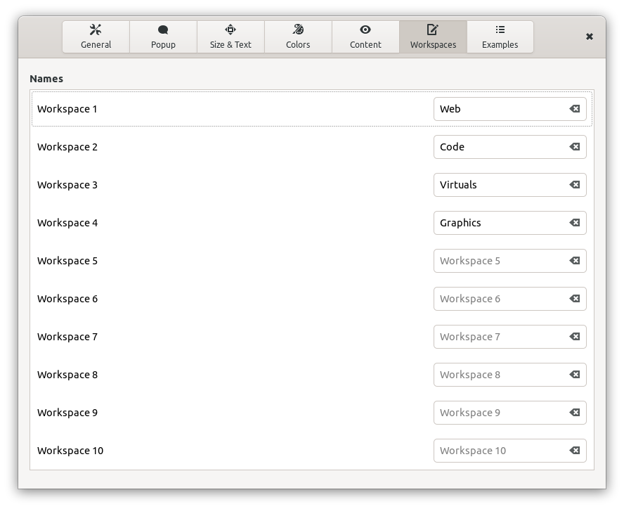
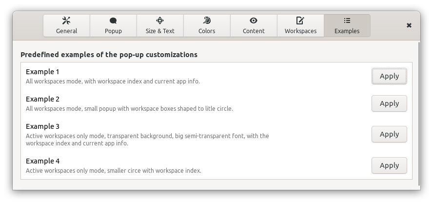

# Workspace Switcher Manager
GNOME Shell extension

The `Workspace Switcher Manager` offers all workspaces related options in one place, adds more options to it and allows you to adjust the workspace switcher popup's size, colors, content and even its orientation.

## Features:

- GNOME Shell 3.36 - 46 compatibility
- All workspace related options available in GNOME Shell
- Adds options `Wraparound` and `Ignore last (empty) workspace` to the workspace switcher
- Option to change workspaces orientation to vertical
- On-Screen and Fade Out time adjustments
- **Allows to add workspace index, workspace name or the most recently used application name or window title to the active and/or inactive workspace boxes in the workspace switcher popup**
- Allows to enter/edit a name for up to 10 workspaces. This option uses original GNOME gsettings key that is shared with other extensions
- **Allows to change position, orientation, size, proportions, colors, opacity and font properties of the workspace popup**
- Option to show the popup with only the box representing the currently active workspace. If you set all popup background colors transparent, you can have just text with information about the active workspace as the ws switcher popup
- Option to keep the popup on screen until you release modifier keys of your workspace switcher shortcut
- Any adjustments applied to the ws switcher popup in the extension Preferences window automatically shows the popup to see the changes
- Example profiles are included to show you the possibilities of the pop-up customization

## Installation

### Installation from extensions.gnome.org

The easiest way to install Workspace Switcher Manager: go to [extensions.gnome.org](https://extensions.gnome.org/extension/4788/workspace-switcher-manager/) and toggle the switch. This installation also gives you automatic updates in the future.

### Installation from the latest Github release

Download the latest release archive using following command:

    wget https://github.com/G-dH/workspace-switcher-manager/releases/latest/download/workspace-switcher-manager@G-dH.github.com.zip

Install the extension:

    gnome-extensions install --force workspace-switcher-manager@G-dH.github.com.zip

### Installation of the latest development version
The most recent version in the repository is the one I'm currently running on my own systems, problems may occur, but usually nothing serious.
Run following commands in the terminal (`git` needs to be installed, navigate to the directory you want to download the source):

#### GNOME 45, 46

    git clone https://github.com/G-dH/workspace-switcher-manager.git
    cd workspace-switcher-manager/
    make install

#### GNOME 42 - 44 

    git clone https://github.com/G-dH/workspace-switcher-manager.git
    cd workspace-switcher-manager/
    git checkout gnome-42-44
    make install

#### GNOME 3.36 - 41 

    git clone https://github.com/G-dH/workspace-switcher-manager.git
    cd workspace-switcher-manager/
    git checkout legacy
    make install

## Enabling the extension

After any installation you need to enable the extension and access its preferences.

- First restart GNOME Shell (`ALt` + `F2`, `r`, `Enter`, or Log Out/Log In if you use Wayland)
- Now you should see the new extension in *Extensions* (or *GNOME Tweak Tool* on older systems) application (reopen the app if needed to load new data), where you can enable it and access its Preferences/Settings.

## Buy me a coffee
If you like my extensions and want to keep me motivated give me some useful feedback, but you can also help me with my coffee expenses:
[buymeacoffee.com/georgdh](https://buymeacoffee.com/georgdh)

## Screenshots

