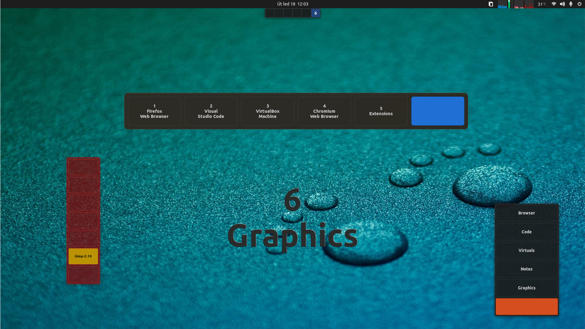
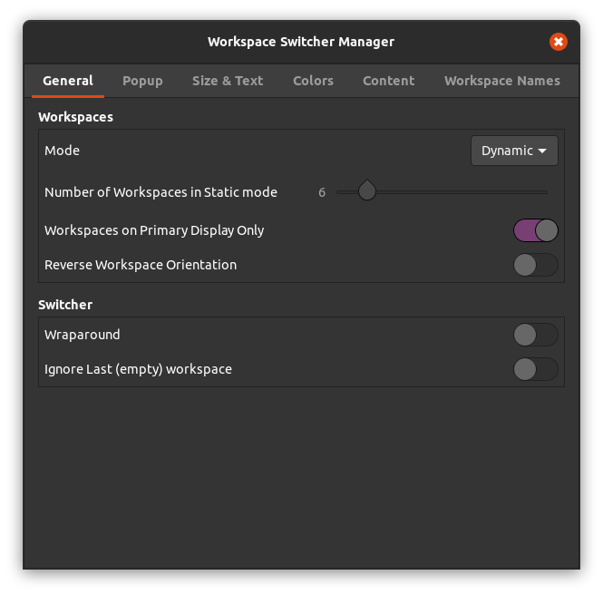
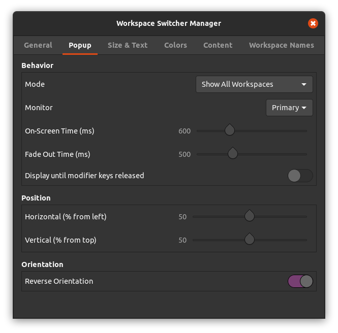
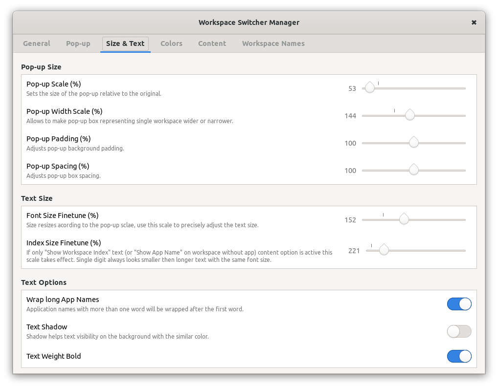
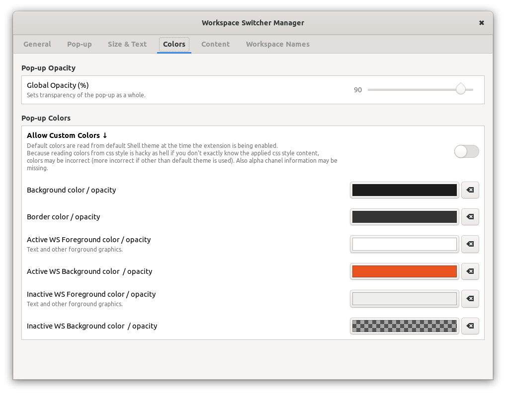
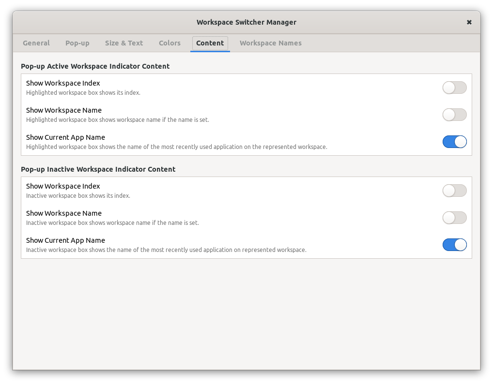
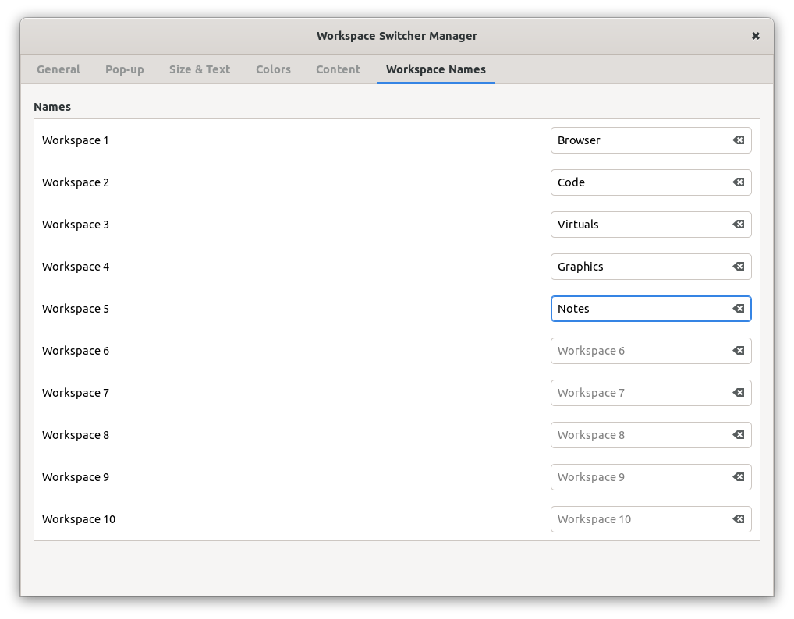

# Workspace Switcher Manager
GNOME Shell extension

The `Workspace Switcher Manager` offers all workspaces related options at one place, adds more options to it and allows you to adjust the workspace switcher popup size, colors, content and even its orientation.

##Features:

- GNOME Shell 3.36, 3.38, 40 and 41 compatibility.
- All workspace related options available in GNOME Shell.
- Adds options `Wraparound` and `Ignore last (empty) workspace` to the workspace switcher.
- Adds option to change workspace orientation. This option is usable in GS 3.36, 3.38, in 40+ brakes the overview (no crashes just miscalculations of size and behavior of some objects).
- On-Screen and Fade Out time adjustmens.
- **Allows to add workspace index, workspace name or the most recently used application name to the active and/or inactive workspace boxes in the workspace switcher popup**.
- Allows to enter/edit a name for up to 10 workspaces. This option uses official GNOME gsettings key, which can be used by other applications too.
- **Allows to change position, orientation, size, proportions, colors, opacity and font properties of the workspace popup**.
- Option to show the popup with only the box representing the currently active workspace. If you set all popup background colors transparent, you can have just text with information about the active workspace as the ws switcher popup.
- Option to keep the popup on screen until you release modifier keys of your workspace switcher shortcut.
- Any adjustments applyed to the ws switcher popup in the extension Preferences window automatically shows the popup to see the changes.

##Instalation

You can just:
- download the code
- extract the `workspace-switcher-manager@G-dH.github.com` direcotory to your `~/local/share/gnome-shell/extensions/` directory
- restart Gnome Shell
- enable and access the Preferences window from the GNOME Extensions app

##Contribution

Contributions are welcome.

## Screenshots

